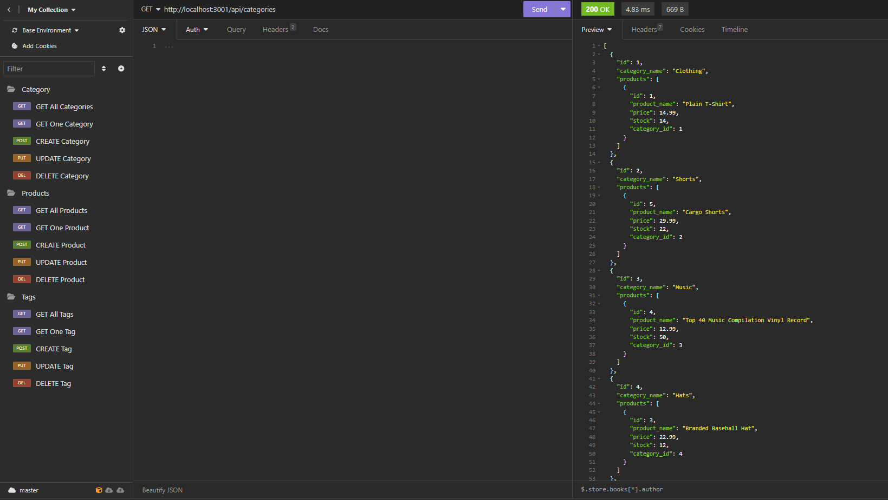
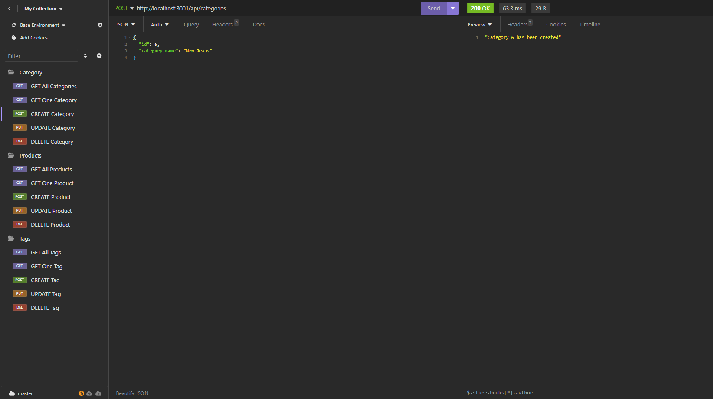
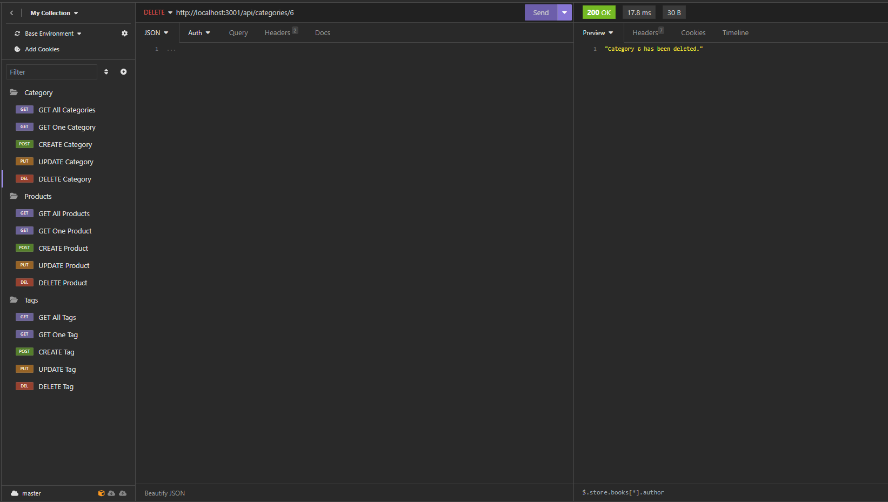

# brandon-orm-ecommerce-backend

[Video Demonstration](https://www.youtube.com/watch?v=f1ctzJ9BzcE)

## Description

This project is an E-commerce backend application connecting `GET`, `POST`, `PUT`, and `DELETE` routes to a database. The database interactions are handled though the `Sequelize` ORM. All of the routes use id's associated with items and their tags. The hardest part was figuring out the foreign key many-to-many relationship route. I learned a lot about how to use ORM's, and creating routing requests using models.

## Table of contents

- [Installation](#installation)
- [Usage](#usage)
- [License](#license)
- [Questions](#questions)

## Installation

1. Clone the repository from `GitHub`.
2. Install or have `Node.js` installed.
3. Install or have `MySQL` and set up an account.
4. Open the cloned repository in VSCode.
5. Open the project inside the integrated terminal.
6. Install all package dependencies using `npm i`.
7. This will install the modules `dotenv`, `express`, `mysql2`, and `sequelize`.

## Usage

1. Make sure to change the `connection.js` file in the `config` folder to your `MySQL` database information.
   (The `.env.EXAMPLE` file is an example of what to enter.)
2. Open the terminal and run the command `mysql -u root -p`.
3. Enter your password to start `MySQL`.
4. Run `schema.sql` located in the `db` folder using `source schema.sql;` to initialize the tables.
5. Quit `MYSQL` and enter `npm run seed` to populate the models with example data.
6. Run the command `npm start` to start the application.
7. Open `Insomnia` and enter `http://localhost:3001/api/routename`
8. Click the `GET` next to the site address to change the operation that is being performed.
9. Example routes include `/categories`, `/products`, and `/tags`. If you want to search/delete a specific product, category, or tag, type `/:id` after your route name with a number replacing `:id`.
10. For `POST` and `PUT` requests, click `Body` under the `GET` and site address.
11. Example category routes: click `JSON`, and type a new id for a create request, or update for an update request.

### Example Home Page

### Example POST Request

### Example PUT Request

### Example DELETE Resuest

## License

Licensed under [MIT](https://opensource.org/license/mit/)

## Questions

You are welcome to contact me with questions using the following:

- [GitHub Profile](https://github.com/bwing2)

- [Email](mailto:brandon.wing245@gmail.com)
